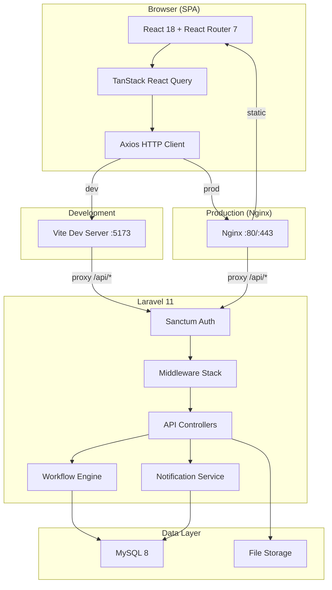
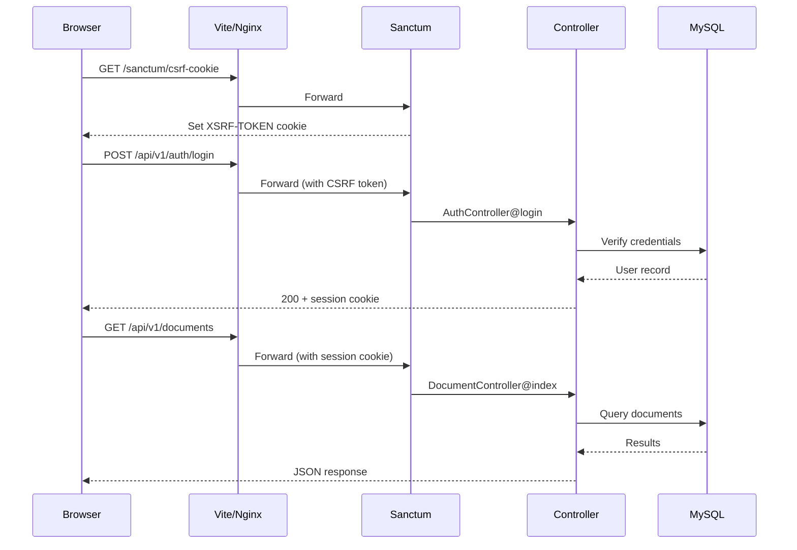

# SAO-IS Architecture Documentation

## System Overview

SAO-IS (Student Affairs Office Information System) is a web-based document management and workflow system for Mapúa Malayan Colleges Laguna (MMCL). It handles student records, organization accreditation documents, event permits, and clearances with a multi-step approval workflow engine.

## Tech Stack

| Layer | Technology | Version |
|-------|-----------|---------|
| Frontend | React + Vite | React 18, Vite 6 |
| Styling | Tailwind CSS | v4 |
| Backend | Laravel (PHP) | Laravel 11, PHP 8.2 |
| Database | MySQL | 8.x |
| Auth | Laravel Sanctum | v4 (SPA cookies) |
| HTTP Client | Axios + TanStack React Query | Axios 1.7, RQ 5 |
| SSO (optional) | MS365 via Azure AD | Not configured |

## Architecture Diagram



## Request Flow



## Database Schema

```mermaid
erDiagram
    users {
        uuid id PK
        string name
        string email UK
        string password_hash
        enum role
        timestamps
    }

    workflow_templates {
        uuid id PK
        string name
        text description
        timestamps
    }

    workflow_steps {
        uuid id PK
        uuid workflow_template_id FK
        string name
        enum assignee_role
        int step_order
    }

    document_types {
        uuid id PK
        string name
        uuid workflow_template_id FK
        int expiry_days
    }

    documents {
        uuid id PK
        string title
        uuid document_type_id FK
        uuid submitted_by FK
        enum status
        uuid current_step_id FK
        date expires_at
        timestamps
    }

    document_versions {
        uuid id PK
        uuid document_id FK
        uuid uploaded_by FK
        int version_number
        string file_path
        string original_filename
        string mime_type
        bigint file_size
        timestamps
    }

    workflow_instances {
        uuid id PK
        uuid document_id FK
        uuid workflow_template_id FK
        uuid current_step_id FK
        enum status
        timestamps
    }

    approvals {
        uuid id PK
        uuid document_id FK
        uuid workflow_step_id FK
        uuid reviewer_id FK
        enum decision
        text remarks
        datetime reviewed_at
    }

    audit_logs {
        uuid id PK
        uuid user_id FK
        string action
        uuid document_id FK
        json metadata
        timestamps
    }

    notifications {
        uuid id PK
        uuid user_id FK
        string message
        uuid document_id FK
        boolean is_read
        timestamps
    }

    users ||--o{ documents : "submits"
    users ||--o{ approvals : "reviews"
    users ||--o{ audit_logs : "generates"
    users ||--o{ notifications : "receives"
    document_types ||--o{ documents : "categorizes"
    document_types }o--|| workflow_templates : "uses"
    workflow_templates ||--o{ workflow_steps : "contains"
    documents ||--o{ document_versions : "has"
    documents ||--o{ approvals : "receives"
    documents ||--o{ workflow_instances : "tracks"
    workflow_steps ||--o{ approvals : "assigned to"
```

## User Roles & Permissions

| Permission | admin | staff | faculty | org_officer | student |
|-----------|-------|-------|---------|-------------|---------|
| Dashboard | ✅ | ✅ | ✅ | ✅ | ✅ |
| View documents | ✅ | ✅ | ✅ | ✅ | ✅ |
| Submit documents | ✅ | ✅ | ✅ | ✅ | ✅ |
| Approve/Reject | ✅ | ✅ | ✅ | ❌ | ❌ |
| Manage users | ✅ | ❌ | ❌ | ❌ | ❌ |
| Manage workflows | ✅ | ✅ | ❌ | ❌ | ❌ |
| Manage doc types | ✅ | ✅ | ❌ | ❌ | ❌ |
| View audit logs | ✅ | ❌ | ❌ | ❌ | ❌ |
| Archive management | ✅ | ✅ | ❌ | ❌ | ❌ |

## Middleware Stack

```
Request → statefulApi (session/CSRF) → auth:sanctum → audit → role:xxx → Controller
```

- **statefulApi**: Adds session, cookie, and CSRF handling for SPA requests from stateful domains
- **auth:sanctum**: Validates session authentication
- **audit**: Logs the API action to the audit_logs table
- **role:xxx**: Checks user role against allowed roles (e.g., `role:admin,staff`)

## Directory Structure

```
SAO-IS/
├── backend/                    # Laravel 11
│   ├── app/
│   │   ├── Http/
│   │   │   ├── Controllers/Api/  # 8 API controllers
│   │   │   └── Middleware/       # RoleMiddleware, AuditLogMiddleware
│   │   ├── Models/               # 9 Eloquent models
│   │   └── Services/             # WorkflowService, NotificationService
│   ├── database/
│   │   ├── migrations/           # 12 migration files
│   │   └── seeders/              # Role + admin user seeders
│   ├── routes/
│   │   ├── api.php               # 37 API routes
│   │   └── web.php               # SPA catch-all (prod only)
│   └── bootstrap/app.php         # Middleware + routing config
├── frontend/                   # React + Vite
│   └── src/
│       ├── api/                  # 7 API modules (axios wrappers)
│       ├── components/
│       │   ├── layout/           # AppShell, Sidebar, Topbar, guards
│       │   └── ui/               # StatusBadge, Pagination, etc.
│       ├── context/              # AuthContext (session state)
│       ├── hooks/                # useAuth, useDocuments, useWorkflow
│       ├── pages/                # 15 page components
│       └── utils/                # constants, formatters
├── docs/                       # Documentation
└── scripts/                    # Deployment scripts
```
